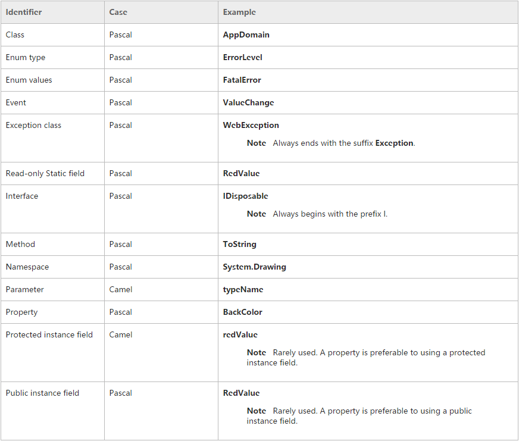

### 写在前边
代码的编写，首先是为人，其次才是为机器。统一的代码风格有利于团队协作及代码维护，真正难以统一的，是编程的思维。墨守陈规，没有独立的思考，人云亦云，只是能够完成任务。只有独立的思考，吸收借鉴他人思想的精华，才能提高自己，与大家共勉。
### 命名
函数命名，变量命名，文件命名要有描述性，少用缩写。
#### 帕斯卡（Pascal）命名法
单字之间不以空格断开或连接号（-）、底线（_）连结，第一个单字首字母采用大写字母；后续单字的首字母亦用大写字母，例如：FirstName、LastName。
#### 骆驼（Camel）命名法
当变量名或函式名是由一个或多个单词连结在一起，而构成的唯一识别字时，第一个单词以小写字母开始；第二个单词的首字母大写或每一个单词的首字母都采用大写字母，例如：myFirstName、myLastName。
#### 命名约定
**避免**使用缩写，如果一定要使用，就谨慎使用。同时，应该保留一个标准缩写的列表，并且在使用时保持一致。  
**避免**使用长名字（最好不超过 15 个字母）。  
**避免**使用相似或者仅在大小写上有区别的名字。  
**必须**使异步方法的结尾为Async。

#### 大小写规则
  
###
**常量**：常量的命名与其他不同，所有单词大写，多个单词之间用 "_" 隔开。  
###
参考：[https://msdn.microsoft.com/zh-cn/library/x2dbyw72(v=vs.71).aspx](https://msdn.microsoft.com/zh-cn/library/x2dbyw72(v=vs.71).aspx "Capitalization Styles")  

#### 缩写
- 不要将缩写或缩略形式用作标识符名称的组成部分。例如，使用 GetWindow，而不要使用 GetWin。  
- 不要使用计算机领域中未被普遍接受的缩写。
- 在适当的时候，使用众所周知的缩写替换冗长的词组名称。例如，用 UI 作为 User Interface 缩 写，用 OLAP 作为 On-line Analytical Processing 的缩写。
- 在使用缩写时，对于超过两个字符长度的缩写请使用 Pascal 大小写或 Camel 大小写。例如使用 HtmlButton 或 HTMLButton；但是，应当大写仅有两个字符的缩写，如：System.IO，而不是 System.Io。
- 不要在标识符或参数名称中使用缩写。如果必须使用缩写，对于由多于两个字符所组成的缩写请使用Camel 大小写。
### 代码布局
- 使用默认的代码编辑器设置（智能缩进、4 字符缩进、制表符保存为空格）。
- 每行只写一条语句。
- 每行只写一个声明。
- 子语句要缩进。
- 如果连续行未自动缩进，请将它们缩进一个制表符位（四个空格）。
- 在方法定义与属性定义之间添加至少一个空白行。
- 即使只有一条子语句要不要省略花括号“ {}”。
- 使用括号突出表达式中的子句，如下面的代码所示。  
	```cs
    if ((val1 > val2) && (val1 > val3))
    {
    	//Take appropriate action.
    }
	```
### 代码注释
注释毫无疑问是让别人以最快速度了解你代码的最快途径，但写注释的目的绝不仅仅是"解释代码做了什么"，更重要的尽量帮助代码阅读者对代码了解的和作者一样多。当你写代码时，你脑海里会有很多有价值的信息，但当其他人读你代码时，这些信息已经丢失，他们所见到的只是眼前代码。
#### 注释标签
##### 常见注释标签列表
  
##### 注释约定
- 修改代码时，总是使代码周围的注释保持最新。
- 将注释放在单独的行上，而非代码行的末尾。
- 以大写字母开始注释文本。
- 以句点结束注释文本。
- 在注释分隔符 (//) 与注释文本之间插入一个空格，如下面的示例所示。
	```cs
    // The following declaration creates a query. It does not run
    // the query.
	```
- 不要在注释周围创建格式化的星号块。
- 如果需要用注释来解释复杂的代码节，请检查此代码以确定是否应该重写它。尽一切可能不注释难以理解的代码，而应该重写它。尽管一般不应该为了使代码更简单以便于人们使用而牺牲性能，但必须保持性能和可维护性之间的平衡。
- 不要为了注释而注释，比如使用GhostDoc生成的注释内容。
- 拒绝日志式注释，源代码管理工具中均能查到变更日志。
- 注释的代码，避免让注释过的代码保留在代码文件中，源代码管理中在任何时刻都可以找回。
- 避免过度注释。
- 只有能让别人读懂的注释才是合格的注释。
###
了解糟糕的注释请戳->：[http://kb.cnblogs.com/page/206954/](http://kb.cnblogs.com/page/206954/)
### 异常捕获
- 异常处理功能使用 `try`、`catch` 和 `finally` 关键字来尝试执行可能失败的操作、在你确定合理的情况下处理故障，以及在事后清除资源。
- 处理异常时请务必处理安全或敏感信息。
- 捕获异常时请确定异常的类型，不要直接捕获`Exception`。
- 必须考虑处理异常带来的性能问题。
- 避免捕获异常后不做处理。
- `try-catch` 模块不要写的太长。
- 禁止使用异常来做流程控制，条件控制。
- `try-catch` 模块中如果有事务，务必即时处理。
### 编码约定
- 始终控制类及方法的大小，当一个类的长度超过400行，一个方法的长度超过25行时，请考虑将其拆分。避免他们做过多的事情，遵循单一职责原则（SRP）。
- 避免不必要的REGION，它会让你忽略方法及类的长度。
- 避免过多的参数，当一个方法的参数超过5个时，请考虑申明一个类来代替多个参数。
- 将 Visual Studio 警告等同于错误。
- 避免复杂的`switch`语句，避免嵌套 `switch`，`switch` 语句必须提供 `default`。
- 避免嵌套过深的`if`语句。
- 长函数切开，尽可能将`switch`语句、`if`语句等提炼到独立函数中。
- 避免使用固定数值，因考虑使用常量代替。
- 值类型参数的使用应规避其默认值。
- WebApi类字段上添加JSONProperty属性指明序列化后的字段名称。
